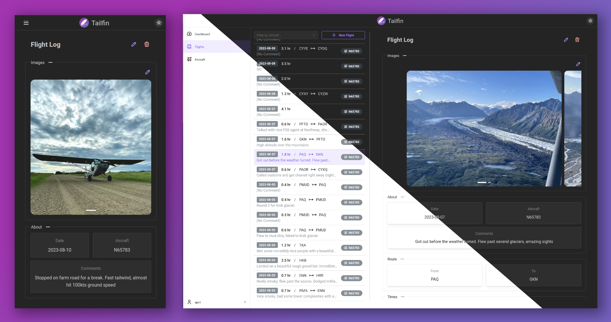

<p align="center">
    <a href="" rel="nooperner">
    </a>
</p>

<h1 align="center">Tailfin</h2>

<h3 align="center">A self-hosted digital flight logbook</h3>



<p align="center">
    <a href="LICENSE"></a>
    <a href="https://www.typescriptlang.org/"></a>
    <a href="https://react.dev/"></a>
    <a href="https://remix.run/"></a>
    <a href="https://tanstack.com/query/latest/"></a>
</p>

## Table of Contents

- [About](#about)
- [Getting Started](#getting_started)
  - [Prerequisites](#prerequisites)
  - [Installation](#installation)
  - [Configuration](#configuration)
- [Usage](#usage)
- [Roadmap](#roadmap)

## About <a name="about"></a>

Tailfin is a digital flight logbook designed to be hosted on a personal server, computer, or cloud solution. This is the
web frontend.

I created this because I was disappointed with the options available for digital logbooks. The one provided by
ForeFlight is likely most commonly used, but my proclivity towards self-hosting drove me to seek out another solution.
Since I could not find any ready-made self-hosted logbooks, I decided to make my own.

## Getting Started <a name="getting_started"></a>

### Prerequisites <a name="prerequisites"></a>

- npm
- [tailfin-api](https://github.com/azpsen/tailfin-api)

### Installation <a name="installation"></a>

1. Clone the repo

```
$ git clone https://git.github.com/azpsen/tailfin-web.git
$ cd tailfin-web
```

3. Install NPM requirements

```
$ npm install
```

5. Build and run the web app

```
$ npm run build && npm run start
```

### Configuration <a name="configuration"></a>

The URL for the Tailfin API can be set with the environment variable `TAILFIN_API_URL`. It defaults to `http://localhost:8081`, which assumes the API runs on the same machine and uses the default port.

## Usage <a name="usage"></a>

Once running, the web app can be accessed at `localhost:3000`

## Roadmap <a name="roadmap"></a>

- [x] Create, view, edit, and delete flight logs
- [x] Aircraft managment and association with flight logs
- [x] Dashboard with statistics
- [x] Attach photos to log entries
- [ ] GPS track recording and map display
- [ ] Calendar view
- [ ] Admin dashboard to manage all users and server configuration
- [ ] Integrate database of airports and waypoints that can be queried to find nearest
